# Procedural Modeling of Cities

The repository is an implementation of [Siggraph01 Procedural Modeling of Cities](https://cgl.ethz.ch/Downloads/Publications/Papers/2001/p_Par01.pdf). We refer to [this article](http://nothings.org/gamedev/l_systems.html) and simplify L-System in this paper to a Priority Queue implementation.

## Input

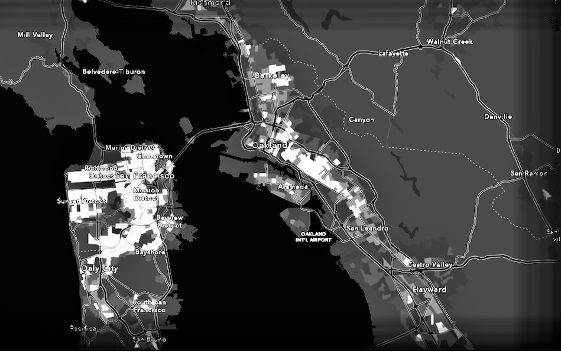

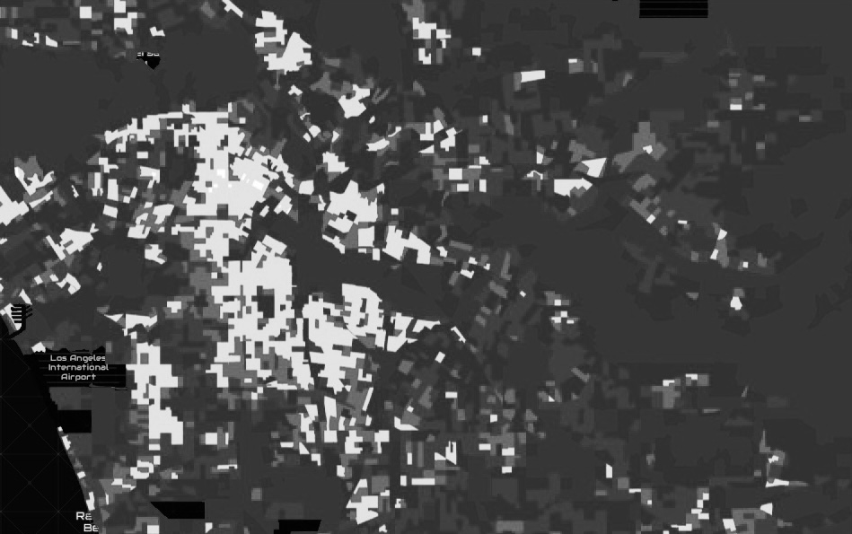

##Path generation

### Highways

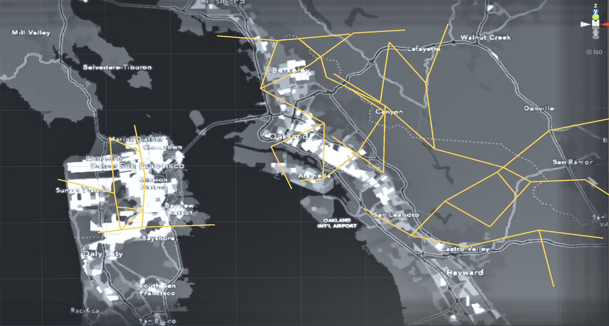

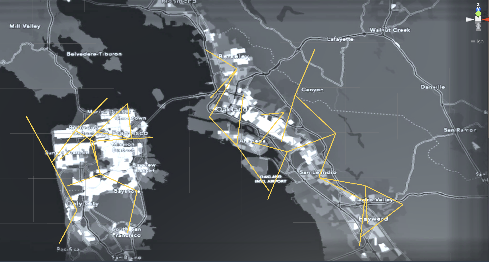

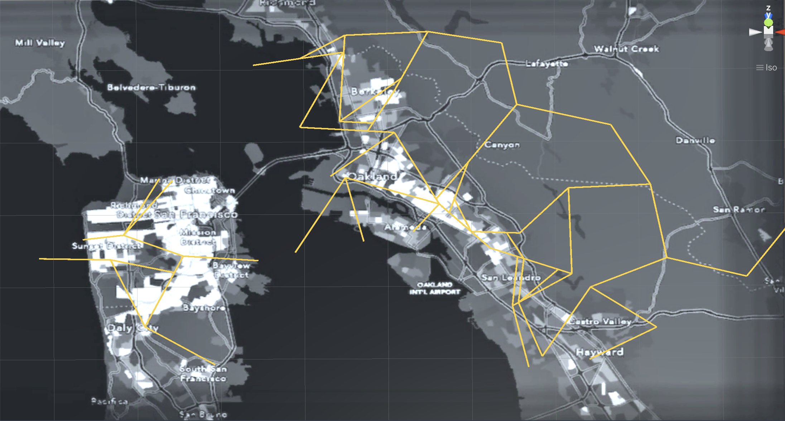

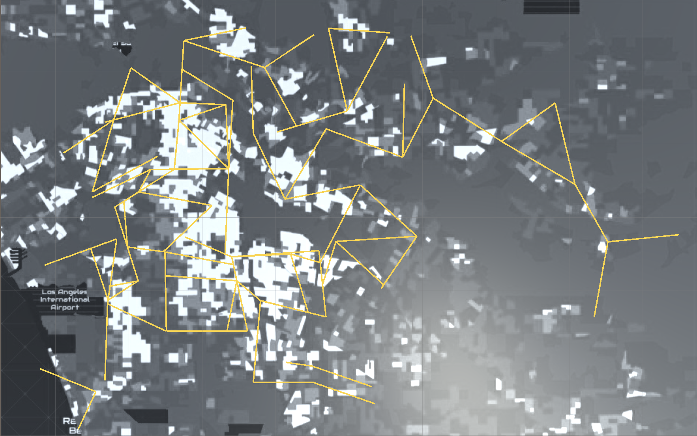

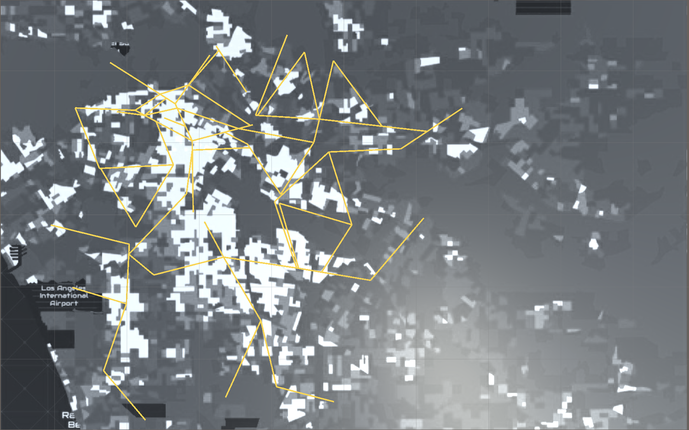

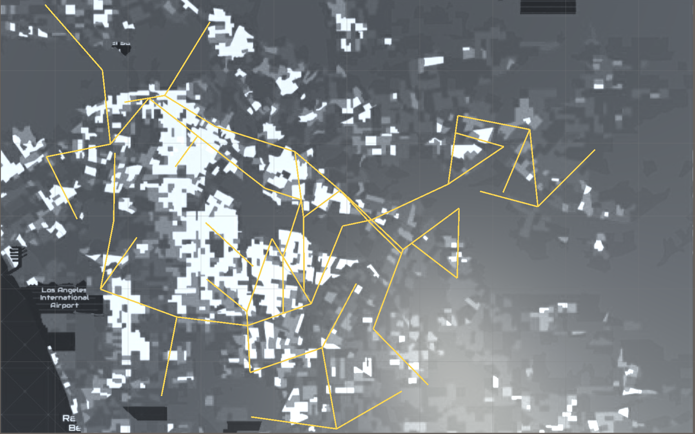

### Highways + Streets

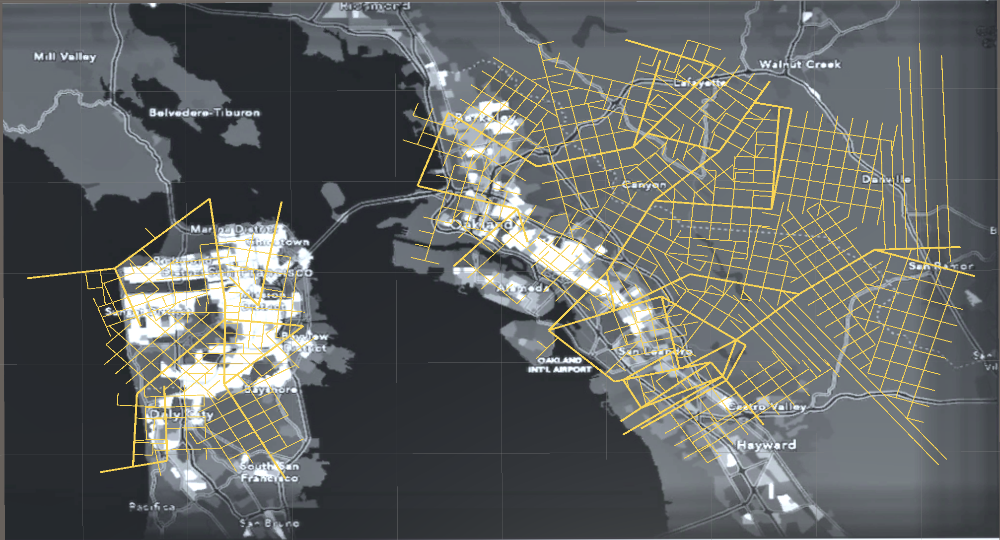

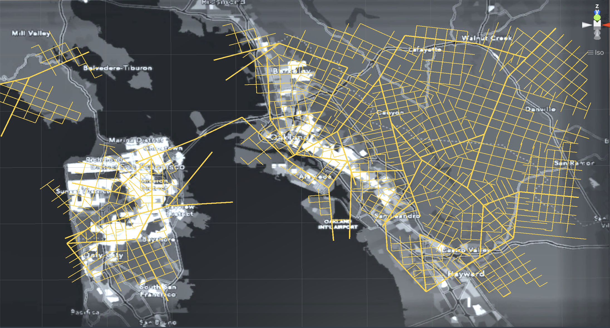

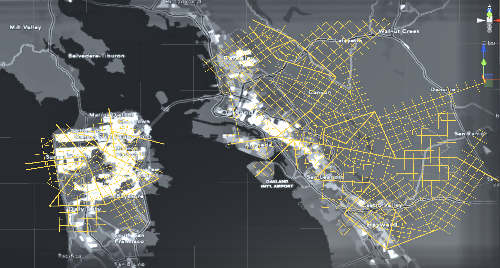

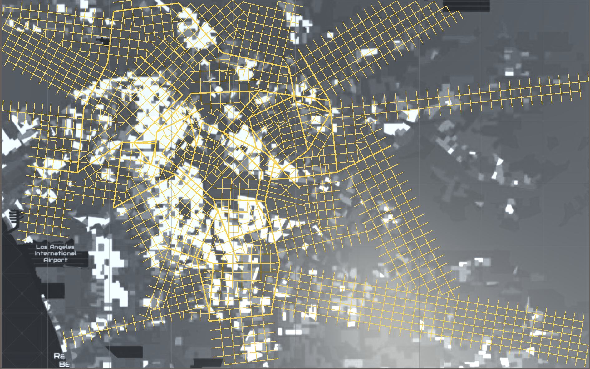

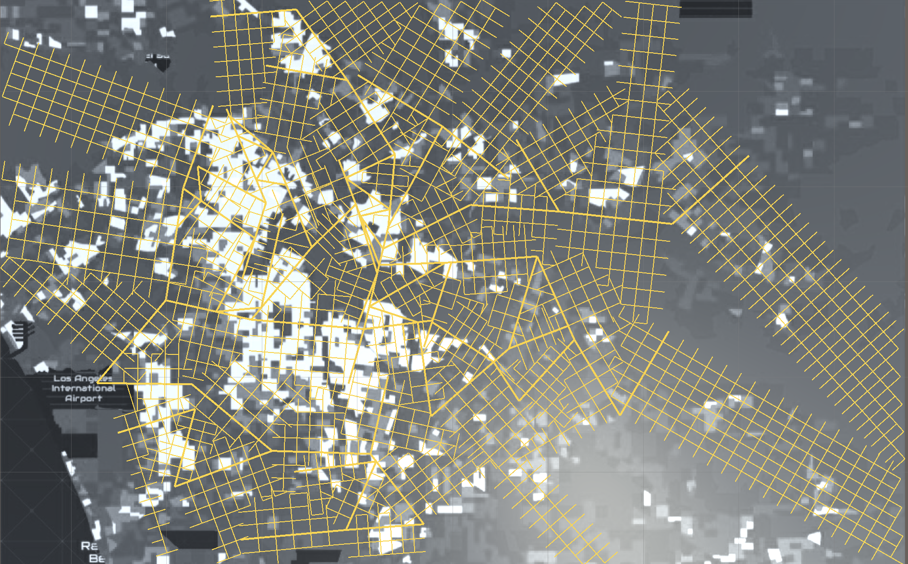

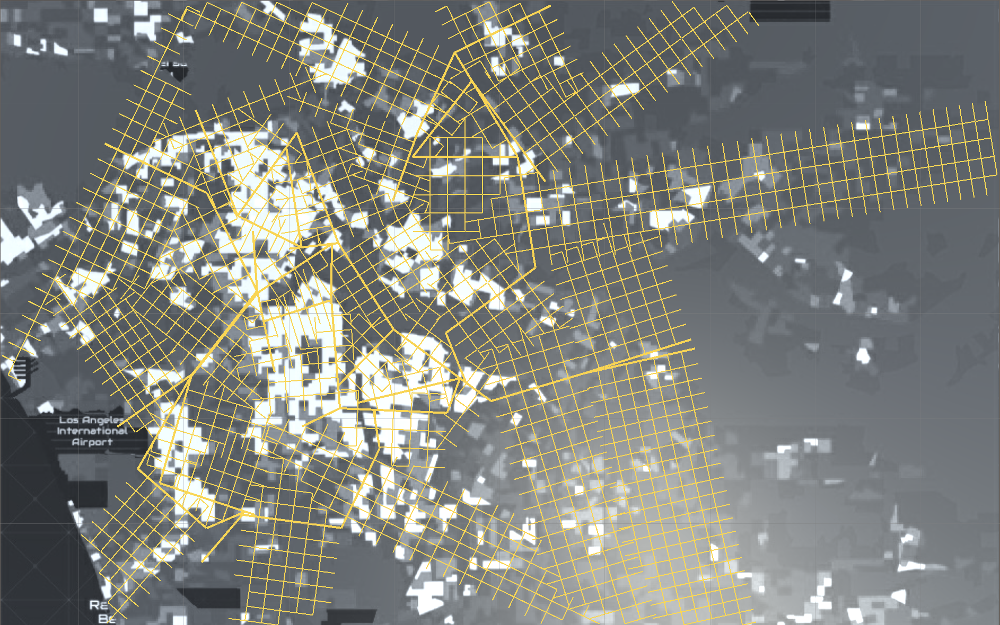

## Buildings

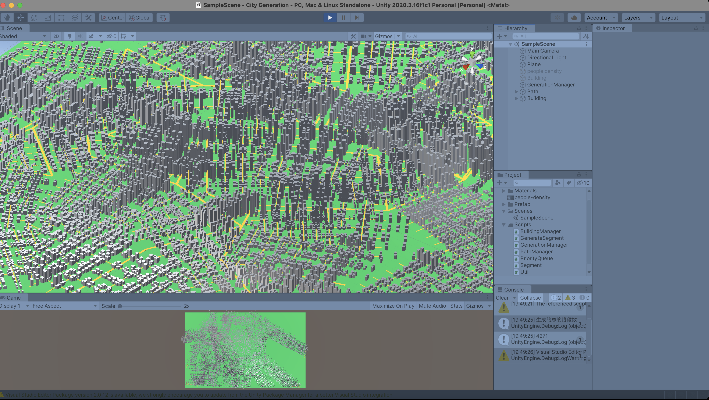

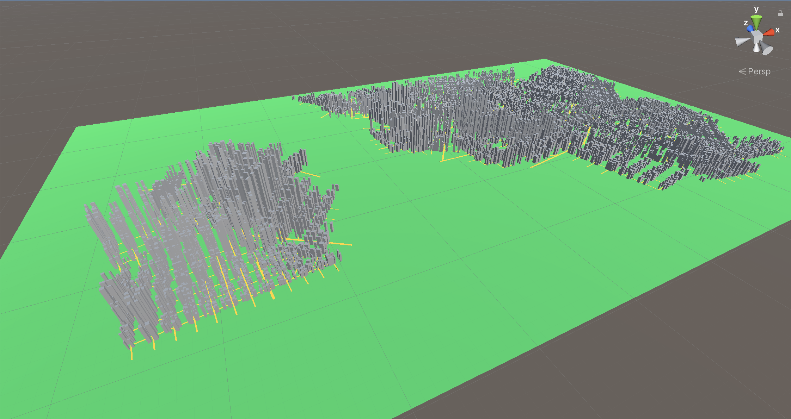

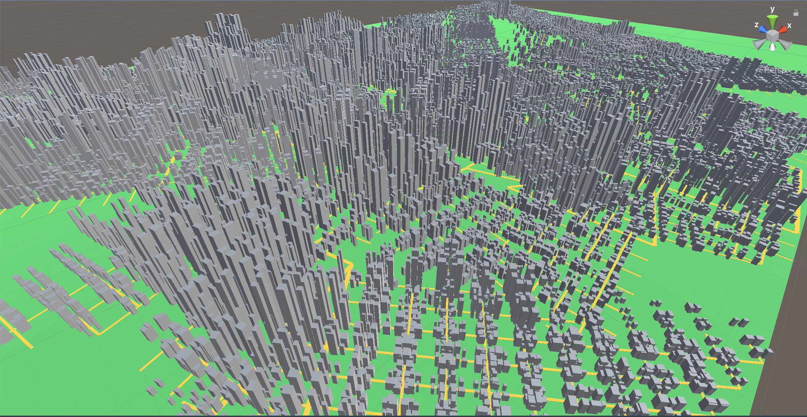

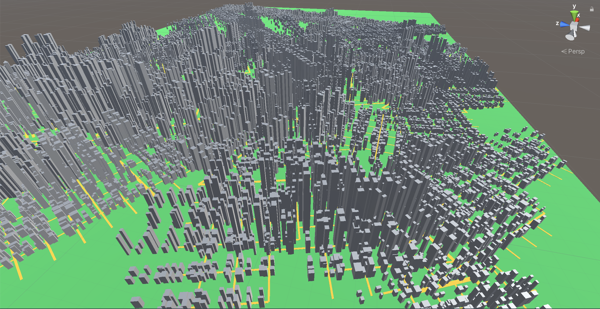

```C#
// 一些尺寸的说明
width = peopleDensity.width; // 人口密度图的宽度
height = peopleDensity.height; // 人口密度图的长度
swidth = peopleDensity.width*mapScale; // 实际Unity里面整个Plane的宽度
sheight = peopleDensity.height*mapScale; // 实际Unity里面整个Plane的长度
minHighway = swidth / 30; // 所有的HighWay都必须大于swidth/30, 删去零碎的路径
minStreet = swidth / 100; // 所有的street都必须大于swidth/100, 删去零碎的路径

// 根据highway生成的street的长度在以下两个值之间随机取值
spawnStreetLower = swidth / 70;
spawnStreetHigher = swidth / 50;
```

